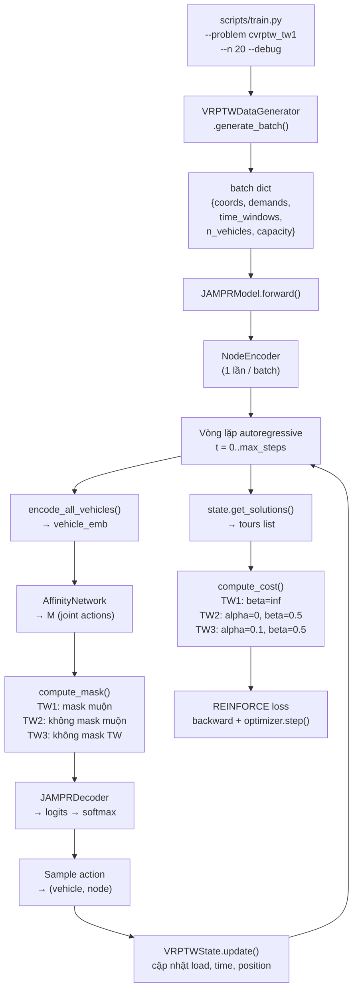

# Cấu Trúc Dự Án JAMPR_FOR_VRPTW & Hướng Dẫn Chạy Theo Từng Loại Ràng Buộc Thời Gian

## 1. Tổng Quan Cấu Trúc Dự Án

```
JAMPR_FOR_VRPTW/
├── configs/                    ← Cấu hình YAML
│   ├── data_config.yaml
│   ├── model_config.yaml
│   └── training_config.yaml
├── scripts/                    ← Điểm khởi chạy CLI
│   ├── train.py
│   ├── evaluate.py
│   ├── generate_data.py
│   └── visualize.py
├── src/                        ← Toàn bộ mã nguồn lõi
│   ├── data/
│   │   ├── generator.py
│   │   └── dataset.py
│   ├── models/
│   │   ├── jampr.py            ← Model chính + VRPTWState
│   │   ├── node_encoder.py
│   │   ├── vehicle_encoder.py
│   │   ├── affinity.py
│   │   ├── decoder.py
│   │   └── attention.py
│   ├── training/
│   │   ├── trainer.py
│   │   ├── reinforce.py
│   │   ├── baseline.py
│   │   └── scheduler.py
│   ├── evaluation/
│   │   ├── metrics.py
│   │   ├── evaluator.py
│   │   └── visualizer.py
│   └── utils/
│       ├── logging_utils.py
│       ├── seed.py
│       ├── tensor_utils.py
│       └── time_utils.py
├── outputs/                    ← Kết quả sinh ra khi chạy
│   ├── checkpoints/
│   ├── logs/
│   └── data/
├── tests/
├── requirements.txt
└── setup.py
```

---

## 2. Mô Tả Chi Tiết Từng Thư Mục / File

### 📁 `configs/`

| File | Chức năng |
|------|-----------|
| `data_config.yaml` | Tham số sinh dữ liệu: số khách hàng, sức chứa `Q`, số xe `K`, khoảng tọa độ, time horizon, chiều rộng time window. Đây là nơi **ràng buộc sức chứa đội xe** (`n_vehicles`) được khai báo. |
| `model_config.yaml` | Kiến trúc mạng: chiều embedding `d_node`, `d_vehicle`, `d_M`, số đầu attention `n_heads`, số lớp SA, `m_con` (xe đồng thời). |
| `training_config.yaml` | Tham số huấn luyện: tốc độ học, số epoch, batch size, `m_pre` (giới hạn quay sớm), đường dẫn lưu checkpoint. Có sẵn preset `debug` cho CPU nhẹ. |

---

### 📁 `scripts/`

| File | Chức năng |
|------|-----------|
| `train.py` | Điểm khởi chạy huấn luyện. Parse args `--problem`, `--n`, `--debug`, `--resume`. Tải config, khởi tạo model, generator, dataset validation, rồi gọi `Trainer.train()`. |
| `evaluate.py` | Chạy đánh giá model đã lưu trên tập test; tính tổng chi phí, in vi phạm ràng buộc. |
| `generate_data.py` | Sinh và lưu tập validation/test dưới dạng `.pt` vào `outputs/data/`. |
| `visualize.py` | Vẽ lộ trình xe trên bản đồ HTML tương tác (Leaflet.js), hiển thị time window, tải trọng. |

---

### 📁 `src/data/`

#### `generator.py` — `VRPTWDataGenerator`

Sinh batch instances ngẫu nhiên theo chuẩn Solomon. Hàm quan trọng:

- `generate_cvrp_batch(n, batch_size)`: Sinh bài toán **CVRP** (không TW). Demand ∈ [1,9], normalize theo `Q`. Trả về `capacity` (Q thô) và `n_vehicles` (K).
- `generate_cvrptw_batch(n, batch_size)`: Sinh bài toán **CVRP-TW** phong cách R201. Tạo time window `[a_i, b_i]` dựa trên khoảng cách đến depot và nhiễu Gaussian. Normalize về `[0,1]`.
- `generate_batch(problem, n, batch_size)`: Dispatcher; nhận `problem ∈ {'cvrp', 'cvrptw_tw1', 'cvrptw_tw2', 'cvrptw_tw3'}`.

> **Ràng buộc sức chứa đội xe**: Cả hai hàm đều đọc `n_vehicles` từ `data_config.yaml` và đưa vào batch dict. `VRPTWState` sẽ dùng giá trị này làm `K` (số xe tối đa).

#### `dataset.py` — `VRPTWDataset`

Wrapper `torch.utils.data.Dataset` để load file `.pt` đã sinh sẵn (dùng cho validation/test cố định).

---

### 📁 `src/models/`

#### `jampr.py` — Trái tim của dự án

Gồm 2 class:

**`VRPTWState`** — Trạng thái bài toán động
| Thuộc tính | Ý nghĩa |
|---|---|
| `coords (B,N+1,2)` | Tọa độ tất cả node (depot + khách) |
| `demands (B,N+1)` | Nhu cầu đã normalize theo Q |
| `time_windows (B,N+1,2)` | Cửa sổ thời gian `[a_i, b_i]` (None nếu CVRP) |
| `service_times (B,N+1)` | Thời gian phục vụ tại mỗi node |
| `capacity` | Sức chứa chuẩn hóa = 1.0 |
| `tours (B,K,L)` | Lộ trình từng xe (node indices) |
| `vehicle_load (B,K)` | Tải còn lại của từng xe |
| `vehicle_time (B,K)` | Thời gian hiện tại của từng xe |
| `active_mask (B,K)` | Xe nào đang hoạt động |
| `next_vehicle (B,)` | Xe tiếp theo chờ được kích hoạt |

Phương thức quan trọng:
- `from_batch()`: Đọc `n_vehicles` từ batch → đặt K, khởi tạo `vehicle_load = 1.0`.
- `update()`: Cập nhật vị trí, thời gian, tải sau mỗi lần giao xe–khách. **Tích hợp chờ TW**: nếu xe đến sớm hơn `a_i`, đặt `arrival = max(arrival, a_i)`.
- `get_vehicle_features()`: Trả về vector `(k/K, dist_depot, x, y, time_norm, remaining_load/capacity)` — 6 đặc trưng cho VehicleEncoder.
- `compute_mask()` (trong `JAMPRModel`): Áp 5 quy tắc che hành động bất khả thi.

**`JAMPRModel`** — Pipeline autoregressive
```
Input batch
    │
    ▼
NodeEncoder      → node_emb (B, N+1, d_node)   [tĩnh, chỉ tính 1 lần]
    │
    ▼ mỗi bước t:
encode_all_vehicles()  → vehicle_emb (B, K, d_vehicle)
    │
    ├─ build_context() → C (B, d_C=640)
    ├─ AffinityNetwork → M (B, m_con*(N+1), d_M)
    ├─ compute_mask()  → mask (B, m_con*(N+1)) bool
    └─ JAMPRDecoder    → logits → softmax → sample action
                                                │
                                          state.update()
```

---

#### `node_encoder.py` — `NodeEncoder`

Mã hóa đặc trưng node `(x, y, demand)` thành embedding qua:
1. Linear projection: ℝ³ → ℝ^d_node
2. N lớp **Self-Attention Block** (SA): MHA + Residual + BatchNorm + FFN

Kết quả: `(B, N+1, d_node)` — **bất biến trong suốt quá trình giải** (tính 1 lần).

#### `vehicle_encoder.py`

Gồm 3 thành phần:

| Class/Hàm | Công thức | Chức năng |
|---|---|---|
| `TourEncoder` (g_s) | MLP(node_emb) → mean | Mã hóa lộ trình đã đi của xe |
| `VehicleEncoder` (g_v) | MLP(v_k) | Mã hóa trạng thái hiện tại xe (6 đặc trưng) |
| `encode_all_vehicles()` | `[g_v(v_k) ; mean(g_s(...))]` | Ghép cả hai, ra `(B,K,d_vehicle)` |

> **Ràng buộc sức chứa** được xe "nhìn thấy" qua `remaining_load` trong `v_k`, giúp mô hình học tự nhiên tránh chọn khách làm tràn sức chứa.

#### `affinity.py` — `AffinityNetwork`

Tính ma trận tương đồng xe–node:
```
g_a(ω_v, ω_n) = W1·ω_n + W2·ω_v + W3·[ω_v ⊙ ω_n ; dot(ω_v, ω_n)]
```
Ra `M (B, m_con*(N+1), d_M)` — không gian hành động kết hợp.

#### `decoder.py` — `JAMPRDecoder`

1. Project context C → d_M
2. MHA(context, M) → h
3. Score = `clip_value * tanh(q·k^T / √d_M)`
4. Masked fill `-inf` các hành động bất khả thi
5. Trả về logits thô (caller dùng softmax)

#### `attention.py`

Implements Multi-Head Attention chuẩn dùng chung cho cả NodeEncoder và Decoder.

---

### 📁 `src/training/`

| File | Chức năng |
|---|---|
| `trainer.py` | Orchestrator chính: vòng lặp epoch, generate batch on-the-fly, forward pass, tính REINFORCE loss, backward, clip gradient, cập nhật baseline, lưu checkpoint. |
| `reinforce.py` | Tính `L = mean((cost - baseline) * Σlog_p)` — hàm mất mát REINFORCE với baseline. |
| `baseline.py` | `RolloutBaseline`: chạy model ở chế độ greedy để làm baseline; cập nhật khi model cải thiện đáng kể (t-test). |
| `scheduler.py` | `InverseLRScheduler`: `lr = lr_init / (1 + γ·epoch)` — giảm tốc độ học theo thời gian. |

---

### 📁 `src/evaluation/`

| File | Chức năng |
|---|---|
| `metrics.py` | `compute_cost()`: tính chi phí theo loại TW (TW1/TW2/TW3 với alpha/beta khác nhau). `check_feasibility()`: kiểm tra vi phạm sức chứa, kích thước đội xe, trùng lặp visit. `compute_arrival_times()`: tính giờ đến từng điểm trong tour. |
| `evaluator.py` | Chạy đánh giá batch trên tập test; tổng hợp metrics. |
| `visualizer.py` | Sinh HTML bản đồ lộ trình. |

---

### 📁 `src/utils/`

| File | Chức năng |
|---|---|
| `logging_utils.py` | Setup logger, `TBWriter` (TensorBoard), `AverageMeter` (tính trung bình running). |
| `seed.py` | `set_seed(seed)`: đặt seed cho torch, numpy, random → tái tạo kết quả. |
| `tensor_utils.py` | `index_to_vehicle_node(action, N1)`: giải mã index hành động phẳng → (vehicle_idx, node_idx). |
| `time_utils.py` | `Timer`: đo thời gian thực thi. |

---

## 3. Ràng Buộc Sức Chứa Đội Xe (Fleet Capacity)

Ràng buộc này hoạt động theo 3 lớp:

```
data_config.yaml
  └─ n_vehicles: {20: 10, 50: 15}   ← K tối đa
       │
       ▼
generator.py → batch["n_vehicles"] = K
       │
       ▼
VRPTWState.from_batch()
  └─ tours (B, K, L)                ← chỉ có K xe
  └─ vehicle_load (B, K) = 1.0      ← khởi tạo đầy
       │
       ▼
compute_mask() → Rule 2: demand[n] > vehicle_load[k] → masked
       │
       ▼
check_feasibility() → len(tours) > n_vehicles → violation
```

---

## 4. Ba Loại Ràng Buộc Thời Gian & Cách Chạy

### 4.1 So Sánh Nhanh

| Chế độ | Đến sớm (< a_i) | Đến muộn (> b_i) | alpha | beta |
|--------|-----------------|------------------|-------|------|
| **TW1** (Hard) | Chờ miễn phí | **Bất khả thi** (bị che mask) | 1.0 | ∞ |
| **TW2** (Soft Late) | Chờ miễn phí | Cho phép + phạt β·δ_bi | 0.0 | 0.5 |
| **TW3** (Soft Full) | **Phạt** α·δ_ai | Cho phép + phạt β·δ_bi | 0.1 | 0.5 |

---

### 4.2 TW1 — Ràng Buộc Cứng (Hard Time Windows)

**Nguyên lý:**
- Xe đến **sớm** → chờ đến `a_i` (không tốn chi phí thêm)
- Xe đến **muộn** hơn `b_i` → **bị mask hoàn toàn** (không cho chọn node này)

**Nơi thực thi trong code:**

```python
# src/models/jampr.py – compute_mask() dòng 493-500
if state.time_windows is not None:
    arrival = state.vehicle_time[b, k].item() + travel_d
    b_n = state.time_windows[b, n, 1].item()
    if arrival > b_n + 1e-8:
        mask[b, ki, n] = True   # ← Hard: che node này

# src/models/jampr.py – update() dòng 185-187 (xử lý chờ)
if self.time_windows is not None:
    a_n = self.time_windows[b, n, 0].item()
    arrival = max(arrival, a_n)   # ← Chờ miễn phí nếu đến sớm

# src/evaluation/metrics.py – compute_cost() dòng 32-33
if problem_type == "cvrptw_tw1":
    alpha, beta = 1.0, float('inf')   # ← beta=inf = bất khả thi
```

**Lệnh chạy:**
```powershell
# Debug nhanh (CPU, vài giây)
cd f:\bai_tap_lap_trinh\Python\JAMPR_FOR_VRPTW
python scripts/train.py --problem cvrptw_tw1 --n 20 --debug

# Full training với N=20
python scripts/train.py --problem cvrptw_tw1 --n 20

# Full training với N=50
python scripts/train.py --problem cvrptw_tw1 --n 50
```

> [!IMPORTANT]
> TW1 là **nghiêm ngặt nhất**. Nếu time window quá hẹp, nhiều node sẽ bị mask đồng thời → có thể dẫn đến toàn bộ action space bị che. Code đã có Rule 4 đảm bảo depot (`node 0`) **không bao giờ bị mask** để tránh deadlock.

---

### 4.3 TW2 — Ràng Buộc Mềm Một Phần (Soft Late)

**Nguyên lý:**
- Xe đến **sớm** → chờ miễn phí đến `a_i` (vẫn cứng)
- Xe đến **muộn** → **vẫn phục vụ được**, nhưng cộng phạt:
  `δ_bi = max(T_ik - b_i, 0)`, chi phí thêm = `β × δ_bi`

**Thay đổi cần thực hiện để chạy TW2:**

Hiện tại `compute_mask()` áp dụng hard constraint cho tất cả TW. Để TW2 hoạt động đúng, cần **bỏ check muộn khỏi mask** khi `problem == "cvrptw_tw2"`. Cập nhật `jampr.py`:

```python
# src/models/jampr.py – compute_mask()
# Rule 3: chỉ áp dụng hard late-mask cho TW1
if state.time_windows is not None:
    arrival = state.vehicle_time[b, k].item() + travel_d
    b_n = state.time_windows[b, n, 1].item()
    # Chỉ mask nếu là TW1 (hard)
    if hasattr(state, 'tw_mode') and state.tw_mode == 'tw1':
        if arrival > b_n + 1e-8:
            mask[b, ki, n] = True
            continue
    # TW2, TW3: không mask node muộn — penalty sẽ xử lý ở cost
```

Penalty được tính trong `metrics.py` (đã đúng):
```python
elif problem_type == "cvrptw_tw2":
    alpha, beta = 0.0, 0.5   # Chỉ phạt muộn, không phạt sớm
```

**Lệnh chạy:**
```powershell
python scripts/train.py --problem cvrptw_tw2 --n 20 --debug
python scripts/train.py --problem cvrptw_tw2 --n 20
python scripts/train.py --problem cvrptw_tw2 --n 50
```

> [!NOTE]
> TW2 cho phép thuật toán tìm được giải pháp **feasible hơn** trong các instance có time window khắt khe. Đổi lại, hàm chi phí sẽ cao hơn TW1 optimal vì cộng thêm penalty phạt.

---

### 4.4 TW3 — Ràng Buộc Mềm Hoàn Toàn (Soft Full)

**Nguyên lý:**
- Đến **sớm** → phạt: `δ_ai = max(a_i - T_ik, 0)`, chi phí = `α × δ_ai`
- Đến **muộn** → phạt: `δ_bi = max(T_ik - b_i, 0)`, chi phí = `β × δ_bi`
- Không có bất kỳ mask hard nào vì TW

**Thay đổi cần thực hiện:**

Ngoài việc tắt hard mask cho muộn (như TW2), cần **bỏ logic `max(arrival, a_i)`** trong `update()` — thay bằng ghi nhận penalty:

```python
# src/models/jampr.py – update() – TW3 không chờ
if self.time_windows is not None and state.tw_mode != 'tw3':
    a_n = self.time_windows[b, n, 0].item()
    arrival = max(arrival, a_n)   # Chỉ chờ cho TW1 và TW2
# TW3: arrival giữ nguyên (penalty tính ở cost function)
```

Penalty `alpha` và `beta` đã đúng trong `metrics.py`:
```python
elif problem_type == "cvrptw_tw3":
    alpha, beta = 0.1, 0.5   # Phạt cả sớm và muộn
```

**Lệnh chạy:**
```powershell
python scripts/train.py --problem cvrptw_tw3 --n 20 --debug
python scripts/train.py --problem cvrptw_tw3 --n 20
python scripts/train.py --problem cvrptw_tw3 --n 50
```

> [!TIP]
> TW3 là **dễ hội tụ nhất** (không có constraint cứng nào về TW nên action space luôn lớn). Dùng TW3 để tiền huấn luyện nếu TW1 gặp khó khăn hội tụ.

---

## 5. Trạng Thái Hiện Tại & Việc Cần Làm

> [!WARNING]
> Hiện tại `compute_mask()` trong `jampr.py` **luôn áp dụng hard late-mask** cho tất cả problem types (kể cả TW2, TW3). Điều này cần được sửa để TW2/TW3 hoạt động đúng ngữ nghĩa.

### Tóm tắt việc cần sửa

| Vấn đề | File | Dòng | Giải pháp |
|--------|------|------|-----------|
| Hard mask áp dụng cho TW2/TW3 | `src/models/jampr.py` | 492–501 | Chỉ mask muộn khi `tw_mode == 'tw1'` |
| `update()` luôn chờ `a_i` dù TW3 | `src/models/jampr.py` | 185–187 | Bỏ chờ khi `tw_mode == 'tw3'` |
| `tw_mode` chưa có trong `VRPTWState` | `src/models/jampr.py` | class VRPTWState | Thêm field `tw_mode: str = 'tw1'` |
| `Trainer` chưa truyền `tw_mode` | `src/training/trainer.py` | 130–131 | Đọc từ `self.problem` và pass vào batch |

---

## 6. Luồng Dữ Liệu Đầy Đủ (End-to-End)



---

## 7. Lệnh Chạy Nhanh Tham Khảo

```powershell
# Đổi vào thư mục dự án
cd f:\bai_tap_lap_trinh\Python\JAMPR_FOR_VRPTW

# ── TW1: Hard Time Windows ──────────────────────────────────────────────────
python scripts/train.py --problem cvrptw_tw1 --n 20 --debug   # Test nhanh
python scripts/train.py --problem cvrptw_tw1 --n 20            # N=20 full
python scripts/train.py --problem cvrptw_tw1 --n 50            # N=50 full

# ── TW2: Soft Late (cần sửa mask trước) ─────────────────────────────────────
python scripts/train.py --problem cvrptw_tw2 --n 20 --debug
python scripts/train.py --problem cvrptw_tw2 --n 20

# ── TW3: Soft Full (cần sửa mask + update trước) ────────────────────────────
python scripts/train.py --problem cvrptw_tw3 --n 20 --debug
python scripts/train.py --problem cvrptw_tw3 --n 20

# ── Pure CVRP (không TW) ─────────────────────────────────────────────────────
python scripts/train.py --problem cvrp --n 20 --debug

# ── Resume từ checkpoint ─────────────────────────────────────────────────────
python scripts/train.py --problem cvrptw_tw1 --n 20 --resume outputs/checkpoints/cvrptw_tw1_20_mcon3_epoch002.pt

# ── Evaluate ─────────────────────────────────────────────────────────────────
python scripts/evaluate.py --problem cvrptw_tw1 --n 20 --checkpoint outputs/checkpoints/...pt
```
